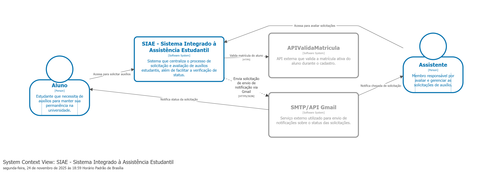
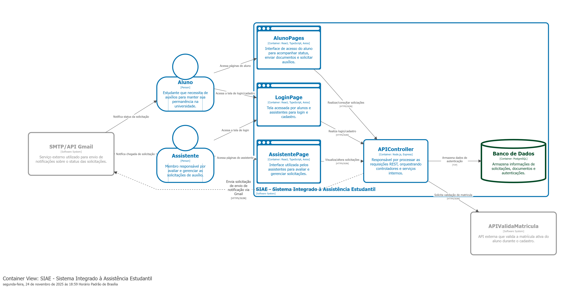
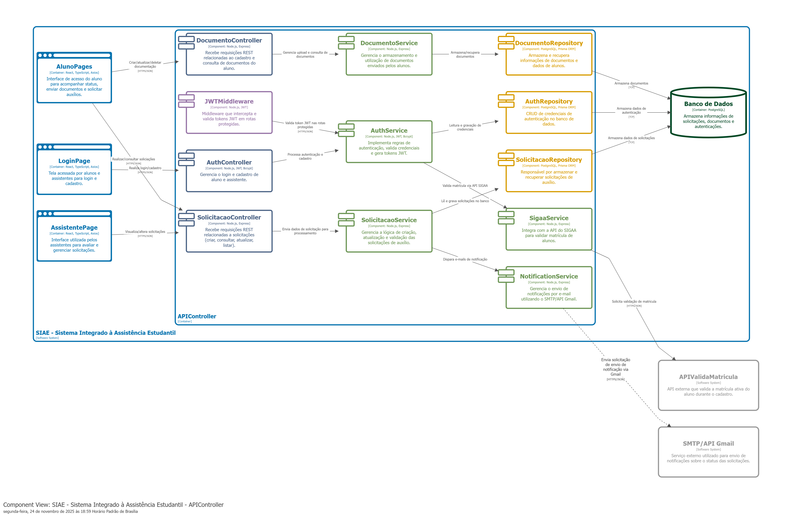

# Arquitetura

## Diagramas da Arquitetura (Modelo C4)

### 1. Diagrama de Contexto (Nível 1)

[<div align="center"></div>](siae-C1_Context.png)

**Propósito:** Fornecer uma visão de alto nível do sistema, mostrando como o SIAE se relaciona com seus usuários e sistemas externos.

**Elementos:**

| Elemento | Descrição |
|----------|-----------|
| **Aluno** | Estudante que necessita de auxílios para manter sua permanência na universidade. Utiliza o sistema para solicitar auxílios e acompanhar o status de suas requisições. |
| **Assistente** | Membro da equipe da assistência estudantil responsável por avaliar, gerenciar e decidir sobre as solicitações submetidas pelos alunos. |
| **SIAE** | Sistema central que processa solicitações de auxílio, gerencia documentos e facilita a comunicação entre alunos e assistentes. |
| **API ValidaMatricula** | Sistema externo (SIGAA) que valida se o aluno possui matrícula ativa na instituição durante o processo de cadastro. |
| **SMTP/API Gmail** | Serviço externo utilizado para envio de notificações automáticas sobre alterações no status das solicitações. |

**Fluxos Principais:**
- Aluno → SIAE: Solicita auxílio e acompanha status
- Assistente → SIAE: Avalia e gerencia solicitações
- SIAE → API ValidaMatricula: Valida matrícula do aluno
- SIAE → SMTP/API Gmail: Envia notificações aos usuários

---

### 2. Diagrama de Contêineres (Nível 2)

[<div align="center"></div>](siae-C2_Containers.png)

**Propósito:** Detalhar os principais contêineres (aplicações executáveis) que compõem o SIAE, suas responsabilidades, tecnologias e formas de comunicação.

**Contêineres:**

| Contêiner | Tecnologia | Responsabilidade |
|-----------|------------|------------------|
| **Cliente Web** | React, TypeScript | Interface de usuário acessada via navegador. Consome a API Controller e gerencia a apresentação dos dados. |
| **API Backend** | Node.js, Express | Processa requisições, aplica regras de negócio, gerencia autenticação e controla acesso aos recursos. |
| **Banco de Dados** | PostgreSQL | Armazena dados de solicitações, documentos, usuários, autenticações e demais registros do sistema. |

**Comunicação:**
- Cliente Web ↔ API Backend: HTTP/REST
- API Backend ↔ Banco de Dados: SQL via Prisma ORM
- API Backend ↔ API ValidaMatricula: HTTP/REST
- API Backend ↔ SMTP/API Gmail: SMTP/HTTPS

---

### 3. Diagrama de Componentes (Nível 3)

[<div align="center"></div>](siae-C3_Components.png)

**Propósito:** Detalhar a organização interna do backend do SIAE, evidenciando os componentes que implementam as funcionalidades do sistema e suas interações.

**Arquitetura Interna:** A API Backend segue o padrão **Controller-Service-Repository**, organizando as responsabilidades em três camadas distintas:

#### Camada de Controller (Ponto de Entrada)
| Componente | Responsabilidade |
|------------|------------------|
| **AuthController** | Recebe requisições de login e cadastro, valida dados de entrada e direciona para o AuthService. |
| **SolicitacaoController** | Processa requisições relacionadas a solicitações de auxílio (criar, consultar, atualizar, listar). |
| **DocumentoController** | Gerencia operações nos documentos enviados pelos alunos. |

#### Camada de Service (Regras de Negócio)
| Componente | Responsabilidade |
|------------|------------------|
| **AuthService** | Implementa lógica de autenticação, valida credenciais e gera tokens JWT. |
| **SolicitacaoService** | Processa dados de solicitações, aplica regras de negócio e encaminha para persistência. |
| **DocumentoService** | Gerencia e valida de documentos enviados. |
| **NotificationService** | Controla envio de notificações por e-mail via SMTP/API Gmail. |
| **SigaaService** | Integra com a API do SIGAA para validação de matrícula. |

#### Camada de Repository (Persistência de Dados)
| Componente | Responsabilidade |
|------------|------------------|
| **AuthRepository** | Armazenamento de dados de autenticação no banco de dados. |
| **SolicitacaoRepository** | Operações de persistência relacionadas a solicitações de auxílio. |
| **DocumentoRepository** | Armazenamento e recuperação de documentos e dados de alunos. |

#### Componentes de Suporte
| Componente | Responsabilidade |
|------------|------------------|
| **JWTMiddleware** | Middleware que intercepta requisições em rotas protegidas e valida tokens JWT antes de prosseguir. |

**Fluxo de Dados:**
```
Requisição → JWTMiddleware (validação) → Controller → Service → Repository → Banco de Dados
```

---

## Padrões Arquiteturais Adotados

### 1. Cliente-Servidor (Client-Server)
- **Aplicação:** Comunicação entre frontend e backend
- **Justificativa:** Separação clara entre interface e lógica de negócio, permitindo escalabilidade independente

### 2. Arquitetura em Camadas (Layered Architecture)
- **Aplicação:** Organização interna do backend
- **Camadas:** Controller → Service → Repository
- **Justificativa:** Separação de responsabilidades, facilidade de manutenção e testabilidade

### 3. Middleware Pattern (JWT)
- **Aplicação:** Autenticação e autorização
- **Justificativa:** Separa a lógica de segurança do restante da aplicação, facilitando manutenção e extensão


##  Visualizando diagramas Structurizr DSL no GitHub

Este projeto utiliza **Structurizr DSL** para gerar diagramas de arquitetura de software.
Como o GitHub não renderiza diagramas automaticamente a partir do `.dsl`, existem duas maneiras simples de visualizar os diagramas.

---

###  Opção 1 — Usar o Structurizr Lite através do Docker (recomendado)

> Para usar esse método é necessário possuir e entender um pouco de docker.

1. **Crie uma pasta no disco C:**

   ```
   C:\structurizrlite
   ```

2. **Coloque o arquivo do projeto dentro dessa pasta:**

   ```
   C:\structurizrlite\workspace.dsl
   ```

3. **Abra o Terminal / PowerShell e navegue até essa pasta:**

   ```powershell
   cd C:\structurizrlite
   ```

4. **Execute o Structurizr Lite usando Docker:**

   ```powershell
   docker run -it --rm -p 8080:8080 `
     -v C:/structurizrlite:/usr/local/structurizr `
     structurizr/lite
   ```

   De forma **generalizada**, o comando seria:

   ```powershell
   docker run -it --rm -p 8080:8080 \
     -v $PWD:/usr/local/structurizr \
     structurizr/lite
   ```
    onde o $PWD seria o caminho

   **Importante:** execute esse comando **dentro da pasta que contém o arquivo `workspace.dsl`**.

5. **Abra no navegador:**

   ```
   http://localhost:8080
   ```

Pronto! Os diagramas serão renderizados automaticamente a partir do arquivo **workspace.dsl**.

---

###  Opção 2 — Usar o editor online do Structurizr (mais simples)

1. Abra o site:
    [https://structurizr.com/dsl](https://structurizr.com/dsl)

2. Copie o conteúdo do arquivo `workspace.dsl`.

3. Cole no **textarea** do editor.

4. Clique no botão **Render** para visualizar os diagramas.

---