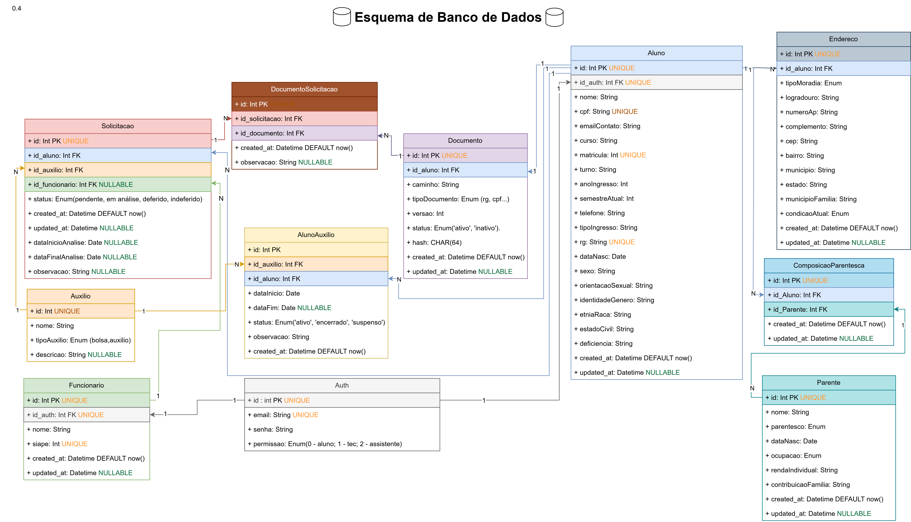

# Esquema de Banco de dados
[<div align="center"></div>](Esquema-de-Banco-de-Dados.drawio.png)


Para visualizar o esquema de banco de dados atual, basta acessar o link do arquivo draw.io. Acesse [aqui](https://drive.google.com/file/d/1GUMBCfDnMkMACP7h49mVVtEl_f3BkbUn/view?usp=sharing)


## Tabelas
- Os enums estão detalhados em uma tabela separada

## **Solicitacao**

- **id**: Int PK UNIQUE
- **id_aluno**: Int FK
- **id_auxilio**: Int FK
- **id_funcionario**: Int FK NULLABLE
- **status**: Enum(statusSolicitacao)
- **created_at**: Datetime DEFAULT now()
- **updated_at**: Datetime NULLABLE
- **dataInicioAnalise**: Date NULLABLE
- **dataFinalAnalise**: Date NULLABLE
- **observacao**: String NULLABLE

## **Documento/Solicitacao**

- **id**: Int PK UNIQUE
- **id_solicitacao**: Int FK
- **id_documento**: Int FK
- **created_at**: Datetime DEFAULT now()
- **observacao**: String NULLABLE

## **Documento**

- **id**: Int PK UNIQUE
- **id_aluno**: Int FK
- **caminho**: String
- **tipoDocumento**: Enum(tipoDocumento)
- **versao**: Int
- **status**: Enum(statusDocumento)
- **hash**: CHAR(64)
- **created_at**: Datetime DEFAULT now()
- **updated_at**: Datetime NULLABLE

---

## **Auxilio**

- **id**: Int PK UNIQUE
- **nome**: String
- **tipoAuxilio**: Enum(tipoAuxilio)
- **descricao**: String NULLABLE

## **AlunoAuxilio**

- **id**: Int PK UNIQUE
- **id_auxilio**: Int FK
- **id_aluno**: Int FK
- **dataInicio**: Date
- **dataFim**: Date NULLABLE
- **status**: Enum(statusAlunoAuxilio)
- **observacao**: String
- **created_at**: Datetime DEFAULT now()

## **Aluno**

- **id**: Int PK UNIQUE
- **id_auth**: Int FK UNIQUE
- **nome**: String
- **cpf**: String UNIQUE
- **emailContato**: String UNIQUE
- **curso**: String
- **matricula**: Int UNIQUE
- **turno**: String
- **anoIngresso**: Int
- **semestreAtual**: Int
- **telefone**: String
- **tipoIngresso**: String
- **rg**: String UNIQUE
- **dataNasc**: Date
- **sexo**: String
- **orientacaoSexual**: String
- **identidadeGenero**: String
- **etniaRaca**: String
- **estadoCivil**: String
- **deficiencia**: String
- **created_at**: Datetime DEFAULT now()
- **updated_at**: Datetime NULLABLE

---

## **Funcionario**

- **id**: Int PK UNIQUE
- **id_author**: Int FK UNIQUE
- **nome**: String
- **siaepe**: Int UNIQUE
- **created_at**: Datetime DEFAULT now()
- **updated_at**: Datetime NULLABLE

---

## **Auth**

- **id**: Int PK UNIQUE
- **email**: String UNIQUE
- **senha**: String
- **permissao**: Enum(permissao)

---

## **Endereço**

- **id**: Int PK UNIQUE
- **id_aluno**: Int FK
- **tipoMoradia**: Enum(tipoMoradia)
- **logradouro**: String
- **numeroAp**: String
- **complemento**: String
- **cep**: String
- **bairro**: String
- **municipio**: String
- **estado**: String
- **municipioFamilia**: String
- **condicaoAtual**: String
- **created_at**: Datetime DEFAULT now()
- **updated_at**: Datetime NULLABLE

---

## **ComposicaoParentesca**

- **id**: Int PK UNIQUE
- **id_Aluno**: Int FK
- **id_Parente**: Int FK
- **created_at**: Datetime DEFAULT now()
- **updated_at**: Datetime NULLABLE

## **Parente**

- **id**: Int PK UNIQUE
- **nome**: String
- **parentesco**: Enum(parentesco)
- **dataNasc**: Date
- **ocupacao**: Enum(ocupacao)
- **rendaIndividual**: String
- **contribuicaoFamilia**: String
- **created_at**: Datetime DEFAULT now()
- **updated_at**: Datetime NULLABLE

## Relacionamentos (Diagrama Resumido)

```
Auth (1) ────── (1) Aluno
Auth (1) ────── (1) Funcionario

Aluno (1) ──── (∞) Solicitacao
Auxilio (1) ── (∞) Solicitacao
Funcionario (1) ─ (∞) Solicitacao

Aluno (1) ──── (∞) AlunoAuxilio
Auxilio (1) ── (∞) AlunoAuxilio

Aluno (1) ──── (∞) Documento
Solicitacao (∞) ──── (∞) Documento (via DocumentoSolicitacao)

Aluno (1) ──── (∞) Endereco

Aluno (1) ──── (∞) ComposicaoParentesca
Parente (1) ──── (∞) ComposicaoParentesca
```
---

### Enums Utilizados

| Tabela/Entidade | Campo | Valores | Descrição |
|-----------------|-------|---------|-----------|
| **Auth** | permissao | ALUNO, TECNICO, ASSISTENTE | Níveis de acesso ao sistema |
| **Usuario** | sexo | MASCULINO, FEMININO, OUTRO, NAO_INFORMAR | Identificação de gênero |
| **Usuario** | estadoCivil | SOLTEIRO, CASADO, DIVORCIADO, VIUVO, UNIAO_ESTAVEL | Estado civil do usuário |
| **Solicitacao** | statusSolicitacao | pendente, em análise, deferido, indeferido | Status da solicitação de auxílio |
| **Documento** | tipoDocumento | rg, cpf, comprovante_matricula, etc. | Tipos de documentos aceitos |
| **Documento** | statusDocumentacao | ativo, inativo | Situação do documento no sistema |
| **AlunoAuxilio** | statusAlunoAuxilio | ativo, encerrado, suspenso | Status do vínculo aluno-auxílio |
| **Endereco** | tipoMoradia | PROPRIA, ALUGADA, CEDIDA, REPUBLICA, OUTRO | Tipo de moradia do aluno |
| **Aluno** | tipoIngresso | SISU, TRANSFERENCIA, OUTRO | Forma de ingresso na instituição |
| **Parente** | parentesco | pai, mae, irmaoIrma, avos, tioTia, primoPrima, conjuge, outro | Grau de parentesco |
| **Parente** | ocupacao | propietarioEmpresa, microempreendedorIndividual, assalariado, aposentadoPensionista, informalAutonomo, pensaoAlimenticia, atividadeRural, bolsistaEstagiario, desempregado | Situação ocupacional do familiar |


---

## Modelo de dados
### Descrição das Tabelas e Relacionamentos
#### **Núcleo do Sistema**

Aluno
- Armazena dados pessoais e acadêmicos do estudante
- Relacionamentos: 1:N com Solicitação, Endereço, ComposicaoParentesca
- Campos únicos: cpf, matricula, rg, emailContato

Funcionario
- Registra servidores da assistência estudantil
- Relacionamento: 1:N com Solicitação (como avaliador)
- Campos únicos: siape, id_author

Auth
- Gerencia credenciais de acesso (email e senha)
- Campo permissão diferencia as regras para as rotas: aluno, técnico, assistente
- Relacionamento: 1:1 com Aluno e Funcionario

#### **Processo de Solicitação**

Auxilio
- Catálogo de auxílios disponíveis (bolsa, auxílio-moradia, auxílio-creche, etc.)
- Relacionamento: 1:N com Solicitacao e AlunoAuxilio

Solicitacao
- Registra cada pedido de auxílio feito por um aluno
- Status: pendente, em análise, deferido, indeferido
- Relacionamentos:
  - N:1 com Aluno
  - N:1 com Auxilio
  - N:1 com Funcionario (avaliador)
  - 1:N com DocumentoSolicitacao

Documento
- Gerencia arquivos enviados pelos alunos
- Controle de versão e hash para integridade
- Status: ativo/inativo
- Relacionamento: 1:N com DocumentoSolicitacao

DocumentoSolicitacao
- Tabela associativa entre Solicitação e Documento
- Permite vincular documentos específicos a cada solicitação

#### **Acompanhamento e Dados Complementares**

AlunoAuxilio
- Histórico de auxílios concedidos aos alunos
- Status: ativo, encerrado, suspenso
- Controle de vigência (dataInicio/dataFim)

Endereço
- Dados de residência do aluno
- Inclui informações sobre moradia e condição atual

ComposicaoParentesca / Parente
- Registro de membros da família e composição familiar
- Informações socioeconômicas para análise de vulnerabilidade
- Tabela associativa: ComposicaoParentesca (N:N entre Aluno e Parente)
